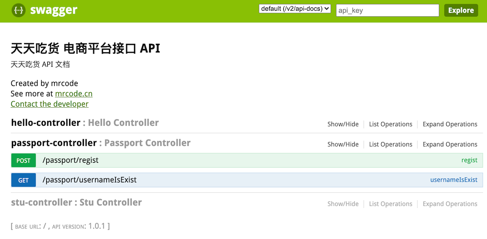

# 整合 Swagger2 文档 Api

为了减少程序员撰写文档时间，提高生产力， Swagger2 应运而生，使用 Swagger2 可以减少编写过多的文档，只需要通过代码就能生成文档API,提供给前端人员

常方便。

引入依赖

```xml
        <!-- swagger2  -->
        <dependency>
            <groupId>io.springfox</groupId>
            <artifactId>springfox-swagger2</artifactId>
            <version>2.4.0</version>
        </dependency>
        <dependency>
            <groupId>io.springfox</groupId>
            <artifactId>springfox-swagger-ui</artifactId>
            <version>2.4.0</version>
        </dependency>
				<!-- swagger2 第三方 UI -->
        <dependency>
            <groupId>com.github.xiaoymin</groupId>
            <artifactId>swagger-bootstrap-ui</artifactId>
            <version>1.6</version>
        </dependency>
```

swagger2 配置

```java
package cn.mrcode.foodiedev.config;

import org.springframework.context.annotation.Bean;
import org.springframework.context.annotation.Configuration;
import org.springframework.web.servlet.config.annotation.ResourceHandlerRegistry;
import org.springframework.web.servlet.config.annotation.ViewControllerRegistry;
import org.springframework.web.servlet.config.annotation.WebMvcConfigurer;
import springfox.documentation.builders.ApiInfoBuilder;
import springfox.documentation.builders.PathSelectors;
import springfox.documentation.builders.RequestHandlerSelectors;
import springfox.documentation.service.ApiInfo;
import springfox.documentation.service.Contact;
import springfox.documentation.spi.DocumentationType;
import springfox.documentation.spring.web.plugins.Docket;
import springfox.documentation.swagger2.annotations.EnableSwagger2;

/**
 * @author mrcode
 * @date 2021/2/13 13:06
 */
@Configuration
@EnableSwagger2
public class Swagger2 {
    // 原始 API 文档：  http://localhost:8088/swagger-ui.html
    // 第三方 API 文档：http://localhost:8088/doc.html
    // 核心配置 docket
    @Bean
    public Docket createTestApi() {
        return new Docket(DocumentationType.SWAGGER_2) // 指定 API 类型为 2
                .apiInfo(apiInfo())                    // 定义 API 文档汇总信息
                .select()
                .apis(RequestHandlerSelectors
                        .basePackage("cn.mrcode.foodiedev.api.controller")) // 指定 controller 包
                .paths(PathSelectors.any())  // 该包中的所有 controller
                .build();
    }

    private ApiInfo apiInfo() {
        return new ApiInfoBuilder()
                .title("天天吃货 电商平台接口 API")   // 标题
                .contact(new Contact("mrcode", "mrcode.cn", "api@mrcode.cn")) // 联系人信息
                .description("天天吃货 API 文档")   // 详细信息
                .version("1.0.1") // 文档版本号
                .termsOfServiceUrl("http://mrcode.cn") // 网站地址
                .build();
    }
}

```

 - 原始 API 文档：  http://localhost:8088/swagger-ui.html

   原始的 UI 文档是由 springfox-swagger-ui 提供的

   

- 第三方 API 文档：http://localhost:8088/doc.html

  第三方的 UI 文档是由 swagger-bootstrap-ui 提供的

  

## 优化 swagger 的显示

- `@ApiIgnore` 忽略显示，可以作用在类上、方法上、参数上

  比如上图中的 stu-controller 不显示，写在该 controller 类上即可

- `@ApiOperation`：参数实体类描述

- `@ApiModelProperty`： 参数字段描述

- `@ApiImplicitParams` 用于在没有实体对象封装参数的时候使用，比如

  ```java
      @ApiImplicitParams({
              @ApiImplicitParam(name = "username", value = "用户名")
      })
      public JSONResult usernameIsExist(@RequestParam String username) 
  ```

优化完成之后的相关 controller 和 bo

```java
@ApiModel(value = "用户对象 BO", description = "从客户端，由用户传入的数据封装在此")
public class UserBO {
    @ApiModelProperty(value = "用户名", name = "username", example = "例如  admin", required = true)
    private String username;
    @ApiModelProperty("密码")
    private String password;
    @ApiModelProperty("确认密码")
    private String confirmPassword;

```

```java
package cn.mrcode.foodiedev.api.controller;

import cn.mrcode.foodiedev.common.util.JSONResult;
import cn.mrcode.foodiedev.pojo.Users;
import cn.mrcode.foodiedev.pojo.bo.UserBO;
import cn.mrcode.foodiedev.service.UserService;
import io.swagger.annotations.Api;
import io.swagger.annotations.ApiImplicitParam;
import io.swagger.annotations.ApiImplicitParams;
import io.swagger.annotations.ApiOperation;
import org.apache.commons.lang3.StringUtils;
import org.springframework.beans.factory.annotation.Autowired;
import org.springframework.http.HttpStatus;
import org.springframework.web.bind.annotation.*;

@Api(value = "注册登录", tags = {"用户注册登录的相关接口"}) // API 分组
@RestController
@RequestMapping("/passport")
public class PassportController {
    @Autowired
    private UserService userService;

    @ApiOperation(value = "用户名是否存在", notes = "判断用户名是否存在", httpMethod = "GET")
    @GetMapping("/usernameIsExist")
    @ApiImplicitParams({
            @ApiImplicitParam(name = "username", value = "用户名")
    })
    public JSONResult usernameIsExist(@RequestParam String username) {
        // 1. 判断用户名不能为空
        if (StringUtils.isBlank(username)) {
            return JSONResult.errorMsg("用户名不能为空");
        }

        // 2. 查找注册的用户名是否存在
        boolean isExist = userService.queryUsernameIsExist(username);
        if (isExist) {
            return JSONResult.errorMsg("用户名已存在");
        }
        // 3. 用户名没有重复
        return JSONResult.ok();
    }

    @ApiOperation(value = "用户注册", notes = "用户用户注册", httpMethod = "POST")
    @PostMapping("/regist")
    public JSONResult regist(@RequestBody UserBO userBO) {
        String username = userBO.getUsername();
        String password = userBO.getPassword();
        String confirmPassword = userBO.getConfirmPassword();
        // 0. 判断用户名和密码必须不为空
        if (StringUtils.isBlank(username) ||
                StringUtils.isBlank(password) ||
                StringUtils.isBlank(confirmPassword)) {
            return JSONResult.errorMsg("用户名或密码不能为空");
        }
        // 1. 查询用户名是否存在
        boolean isExist = userService.queryUsernameIsExist(username);
        if (isExist) {
            return JSONResult.errorMsg("用户名已经存在");
        }
        // 2. 密码长度不能少于 6 位
        if (password.length() < 6) {
            return JSONResult.errorMsg("密码长度不能少于 6");
        }
        // 3. 判断两次密码是否一致
        if (!password.equals(confirmPassword)) {
            return JSONResult.errorMsg("两次密码输入不一致");
        }
        // 4. 实现注册
        Users user = userService.createUser(userBO);
        return JSONResult.ok(user);
    }
}

```

