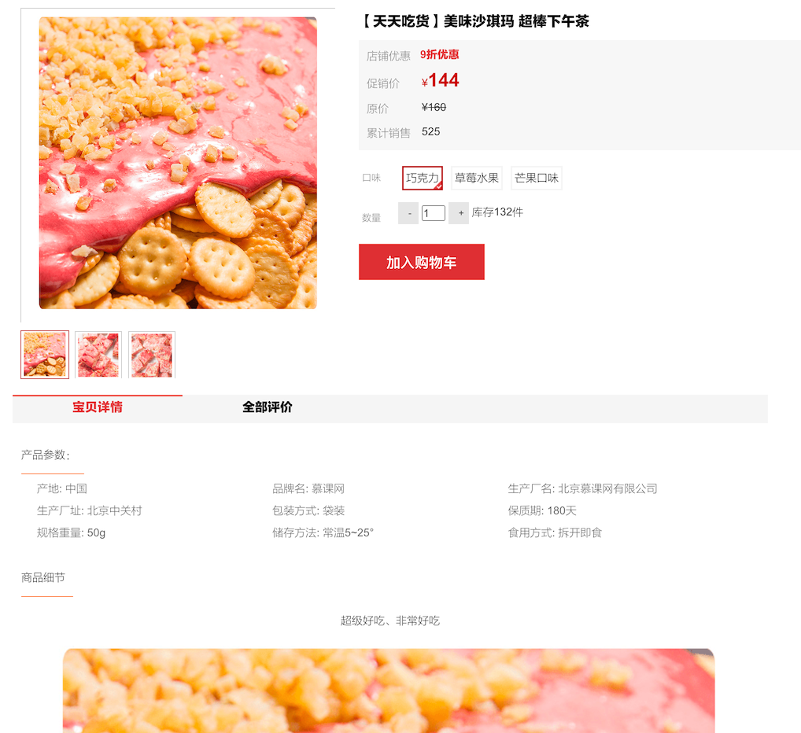

# 商品详情页

## 需求分析



有几大块：

- 商品首图和图片列表
- 商品的基本信息：商品名称、商品内容
- 商品规格：上图来说就是口味、价格、优惠价、原价、库存
- 商品参数：对应上图的产品参数

这里的商品信息相对简单，分成了主要的以下 3 张表（图片表前面讲过了）


## 前端展示分析

当进入商品详情时是一次性加载所有的商品信息还是分开？

- 一次性：优点是当重复刷新页面的时候（比如秒杀），到达后端的请求量少了
- 分开查询：如图片列表、商品基本信息、规格信息、商品参数，发送 4 次请求

分开查询方式是 **推荐** 的方式，但是为了简便，这里使用一次性查询出所有信息。

## 商品详情接口

这里就简单了，总共 4 块内容，在 4 张表中，只需要单独查询出来就可以

```java
package cn.mrcode.foodiedev.service.impl;

import cn.mrcode.foodiedev.mapper.ItemsImgMapper;
import cn.mrcode.foodiedev.mapper.ItemsMapper;
import cn.mrcode.foodiedev.mapper.ItemsParamMapper;
import cn.mrcode.foodiedev.mapper.ItemsSpecMapper;
import cn.mrcode.foodiedev.pojo.Items;
import cn.mrcode.foodiedev.pojo.ItemsImg;
import cn.mrcode.foodiedev.pojo.ItemsParam;
import cn.mrcode.foodiedev.pojo.ItemsSpec;
import cn.mrcode.foodiedev.service.ItemService;
import org.springframework.beans.factory.annotation.Autowired;
import org.springframework.stereotype.Service;
import org.springframework.transaction.annotation.Propagation;
import org.springframework.transaction.annotation.Transactional;
import tk.mybatis.mapper.entity.Example;

import java.util.List;

/**
 * @author mrcode
 * @date 2021/2/15 14:48
 */
@SuppressWarnings("SpringJavaInjectionPointsAutowiringInspection")
@Service
public class ItemServiceImpl implements ItemService {
    @Autowired
    private ItemsMapper itemsMapper;
    @Autowired
    private ItemsImgMapper itemsImgMapper;
    @Autowired
    private ItemsSpecMapper itemsSpecMapper;
    @Autowired
    private ItemsParamMapper itemsParamMapper;

    @Transactional(propagation = Propagation.SUPPORTS)
    @Override
    public Items queryItemById(String itemId) {
        return itemsMapper.selectByPrimaryKey(itemId);
    }

    @Transactional(propagation = Propagation.SUPPORTS)
    @Override
    public List<ItemsImg> queryItemImgList(String itemId) {
        Example itemsImgExp = new Example(ItemsImg.class);
        Example.Criteria criteria = itemsImgExp.createCriteria();
        criteria.andEqualTo("itemId", itemId);

        return itemsImgMapper.selectByExample(itemsImgExp);
    }

    @Transactional(propagation = Propagation.SUPPORTS)
    @Override
    public List<ItemsSpec> queryItemSpecList(String itemId) {
        Example itemsSpecExp = new Example(ItemsSpec.class);
        Example.Criteria criteria = itemsSpecExp.createCriteria();
        criteria.andEqualTo("itemId", itemId);

        return itemsSpecMapper.selectByExample(itemsSpecExp);
    }

    @Transactional(propagation = Propagation.SUPPORTS)
    @Override
    public ItemsParam queryItemParam(String itemId) {
        Example itemsParamExp = new Example(ItemsParam.class);
        Example.Criteria criteria = itemsParamExp.createCriteria();
        criteria.andEqualTo("itemId", itemId);

        return itemsParamMapper.selectOneByExample(itemsParamExp);
    }
}

```

```java
package cn.mrcode.foodiedev.api.controller;

import cn.mrcode.foodiedev.common.util.JSONResult;
import cn.mrcode.foodiedev.pojo.Items;
import cn.mrcode.foodiedev.pojo.ItemsImg;
import cn.mrcode.foodiedev.pojo.ItemsParam;
import cn.mrcode.foodiedev.pojo.ItemsSpec;
import cn.mrcode.foodiedev.pojo.vo.ItemInfoVO;
import cn.mrcode.foodiedev.service.ItemService;
import io.swagger.annotations.Api;
import io.swagger.annotations.ApiOperation;
import io.swagger.annotations.ApiParam;
import org.apache.commons.lang3.StringUtils;
import org.springframework.beans.factory.annotation.Autowired;
import org.springframework.web.bind.annotation.*;

import java.util.List;

@Api(value = "商品接口", tags = {"商品信息展示的相关接口"})
@RestController
@RequestMapping("items")
public class ItemsController {

    @Autowired
    private ItemService itemService;

    @ApiOperation(value = "查询商品详情", notes = "查询商品详情", httpMethod = "GET")
    @GetMapping("/info/{itemId}")
    public JSONResult info(
            @ApiParam(name = "itemId", value = "商品id", required = true)
            @PathVariable String itemId) {

        if (StringUtils.isBlank(itemId)) {
            return JSONResult.errorMsg(null);
        }

        Items item = itemService.queryItemById(itemId);
        List<ItemsImg> itemImgList = itemService.queryItemImgList(itemId);
        List<ItemsSpec> itemsSpecList = itemService.queryItemSpecList(itemId);
        ItemsParam itemsParam = itemService.queryItemParam(itemId);

        ItemInfoVO itemInfoVO = new ItemInfoVO();
        itemInfoVO.setItem(item);
        itemInfoVO.setItemImgList(itemImgList);
        itemInfoVO.setItemSpecList(itemsSpecList);
        itemInfoVO.setItemParams(itemsParam);

        return JSONResult.ok(itemInfoVO);
    }
}
```


