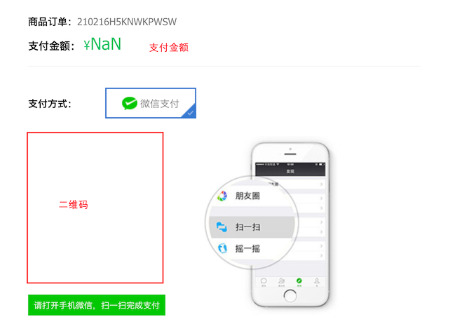
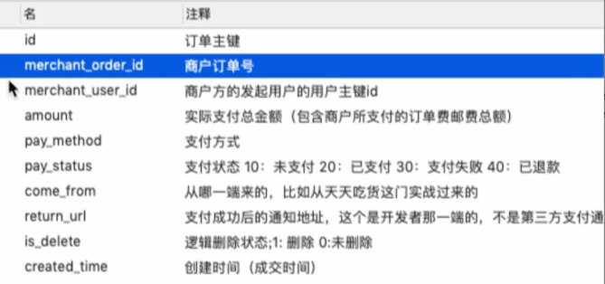
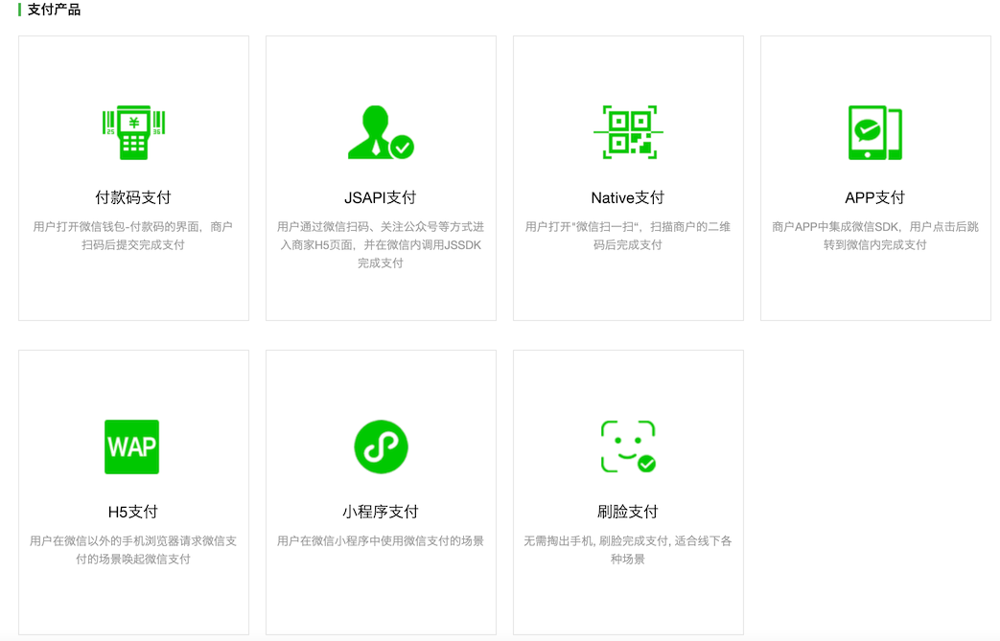
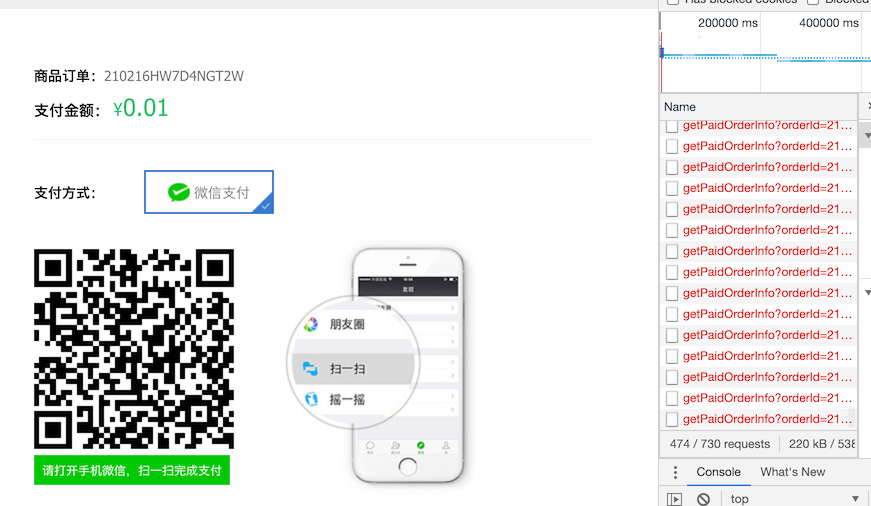
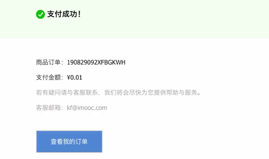

# 微信支付



## 微信支付页前端代码

创建订单后，根据订单支付类型，跳转到不同的支付页面，微信使用了二维码的形式，前端核心代码如下

```javascript
    <script type="text/javascript">
        var index = new Vue({
            el: "#wxpay",
            data: {
                userIsLogin: false,
                userInfo: {},

                orderId: null,
                paymentInfo: [],
            },
            created() {
                // var me = this;
                // 通过cookie判断用户是否登录
                this.judgeUserLoginStatus();

                // 获得订单号
                var orderId = app.getUrlParam("orderId");
                // 如果orderId为空，跳转到错误页面
                if (orderId == null || orderId == undefined || orderId == '') {
                    app.goErrorPage();
                    return;
                }

                this.orderId = orderId;
                this.getWXPayQRCodeUrl(orderId);

                // 每隔3秒调用后台方法，查看订单是否已经支付成功
                this.setTimer();
            },
            methods: {
                setTimer() {
                    return setInterval(()=>{
                        this.checkPayResult()
                    }, 3000)
                },
                // 查询是否支付成功 
                checkPayResult() {
                    var orderId = this.orderId;
                    // console.log(orderId);
                    // 查询订单是否成功
                    var userInfo = this.userInfo;

                    // 发起请求获得微信支付扫描二维码
                    var serverUrl = app.serverUrl;
					axios.defaults.withCredentials = true;
					axios.post(
                            serverUrl + '/orders/getPaidOrderInfo?orderId=' + orderId, 
							{},
							{
								headers: {
									'headerUserId': userInfo.id,
									'headerUserToken': userInfo.userUniqueToken
								}
							})
							.then(res => {
								if (res.data.status == 200) {
                                    var orderStatus = res.data.data;
                                    // console.log(orderStatus);

                                    if (orderStatus.orderStatus == 20) {
                                        window.location.href = "success.html?orderId=" + orderId + "&orderAmount=" + this.paymentInfo.amount;
                                    }
								} else {
									alert(res.data.msg);
								}
							});
                },
                getWXPayQRCodeUrl(orderId) {
                    var userInfo = this.userInfo;

                    // 发起请求获得微信支付扫描二维码
                    var paymentServerUrl = app.paymentServerUrl;
					axios.defaults.withCredentials = true;
					axios.post(
                            paymentServerUrl + '/payment/getWXPayQRCode?merchantUserId=' + userInfo.id + "&merchantOrderId=" + orderId, 
							{},
							{
								headers: {
									'imoocUserId': "imooc",
									'password': "imooc"
								}
							})
							.then(res => {
								if (res.data.status == 200) {
                                    var paymentInfo = res.data.data;
                                    this.paymentInfo = paymentInfo;
                                    // qrCodeUrl
                                    // console.log(paymentInfo);
                                    
                                    $('#wxqrcode-display').qrcode({
                                        width: 200,
                                        height:200,
                                        text: paymentInfo.qrCodeUrl
                                    });


								} else {
									alert(res.data.msg);
								}
							});
                },
                // 通过cookie判断用户是否登录
                judgeUserLoginStatus() {
                    var userCookie = app.getCookie("user");
                    if (
                        userCookie != null &&
                        userCookie != undefined &&
                        userCookie != ""
                    ) {
                        var userInfoStr = decodeURIComponent(userCookie);
                        // console.log(userInfo);
                        if (
                            userInfoStr != null &&
                            userInfoStr != undefined &&
                            userInfoStr != ""
                        ) {
                            var userInfo = JSON.parse(userInfoStr);
                            // 判断是否是一个对象
                            if ( typeof(userInfo)  == "object" ) {
                                this.userIsLogin = true;
                                // console.log(userInfo);
                                this.userInfo = userInfo;
                            } else {
                                this.userIsLogin = false;
                                this.userInfo = {};
                            }
                        }
                    } else {
                        this.userIsLogin = false;
                        this.userInfo = {};
                    }
                }
            }
        });
```

大致流程如下：

1. 判断用户是否登录
2. 从 URL 中获取到订单 ID
3. 去聚合支付中心获取二维码
4. 启动一个定时任务，每隔 3 秒一次，去后端检查当前订单是否支付成功

那么这里后端需要填充的代码则有：

1. 微信支付到聚合支付中心下单
2. 检查订单是否支付成功

## 支付中心订单设计

前端代码中获取二维码的请求地址

```javascript
paymentServerUrl + '/payment/getWXPayQRCode?merchantUserId=' + userInfo.id + "&merchantOrderId=" + orderId
```

这个是聚合支付中心的请求地址，所以需要在支付中心先存在订单，下表是支付中心的订单设计



需要向支付中心下单的字段有：

- 商户订单号
- 商户方发起用户的用户主键 id
- 实际支付总金额
- 支付方式
- 支付成功后的通知地址

## 微信支付时序图

[微信支付官方文档](https://pay.weixin.qq.com/wiki/doc/api/index.html)



- 付款码支付：你需要展示你的付款码，商户扫描付款码，完成扣款
- JSAPI 支付：需要在微信公众号内部浏览器调用 jssdk 进行支付
- Native 支付：用户打开微信扫描商户的二维码完成支付，这个也是我们课程中所使用的方式
- App 支付：app 集成支付后，跳转到微信的支付
- H5 支付：手机端的 H5 页面，唤醒微信支付

[在 Native 支付的开发指引里面](https://pay.weixin.qq.com/wiki/doc/api/native.php?chapter=6_5&index=3) 有一个描述时序图的说明


- 商户后台系统

  在本课程中有两个端，老师提供的聚合支付中心  和 我们自己的后端服务

商户这边生成二维码如上图：

1. 生成自己的商户订单

2. 调用统一下单 API，生成 **预支付交易**

   这个就类似与，我们使用它的支付，那么就需要先在他这里产生一条订单信息，后续的相关操作，就可以使用这个预支付订单完成

3. 返回预支付交易链接，其实就是一个 二维码的 url 地址

4. 商户这边通过二维码工具将返回的二维码地址，生成在二维码图片中

5. 这是商户就可以掏出手机扫描二维码了

## 支付完成回调通知

```java
    @PostMapping("notifyMerchantOrderPaid")
    public Integer notifyMerchantOrderPaid(String merchantOrderId) {
        orderService.updateOrderStatus(merchantOrderId, OrderStatusEnum.WAIT_DELIVER.type);
        return HttpStatus.OK.value();
    }
```

```java
    @Transactional(propagation = Propagation.REQUIRED)
    @Override
    public void updateOrderStatus(String orderId, Integer orderStatus) {

        OrderStatus paidStatus = new OrderStatus();
        paidStatus.setOrderId(orderId);
        paidStatus.setOrderStatus(orderStatus);
        paidStatus.setPayTime(new Date());

        orderStatusMapper.updateByPrimaryKeySelective(paidStatus);
    }
```

支付成功之后，支付中心通知我们的后台，我们将该订单状态变更为  「已付款，待发货」状态

## 构建商户订单

首先，老师提供的聚合支付中心，创建商户订单地址如下，同时上面我们写好了支付完成的回调接口地址，在 baseController 中先定义常量

```java
    // 支付中心的调用地址
    String paymentUrl = "http://payment.t.mukewang.com/foodie-payment/payment/createMerchantOrder";		// produce

    // 微信支付成功 -> 支付中心 -> 天天吃货平台
    //                       |-> 回调通知的url
    String payReturnUrl = "http://localhost:8088/orders/notifyMerchantOrderPaid";
```

支付中心项目在练习项目仓库下，但是本地跑起来也没有用，因为需要你的微信支付相关信息，还需要域名等。

不过可以去看看学习下，如何构建一个聚合支付中心。

在创建订单的服务里面，有一段代码如下

```java
        // 4. 构建商户订单，用于传给支付中心
        MerchantOrdersVO merchantOrdersVO = new MerchantOrdersVO();
        merchantOrdersVO.setMerchantOrderId(orderId);
        merchantOrdersVO.setMerchantUserId(userId);
        merchantOrdersVO.setAmount(realPayAmount + postAmount);
        merchantOrdersVO.setPayMethod(payMethod);
```

这个是按照支付中心的商户订单接口，所需要的信息构建的 VO 对象。

## 向支付中心发送商户订单

在 controller 中，填充对构建商户订单代码。我们要发送 HTTP 请求到支付中心，这里使用 `org.springframework.web.client.RestTemplate`

### RestTemplate 配置

```java
package cn.mrcode.foodiedev.config;

import org.springframework.context.annotation.Bean;
import org.springframework.context.annotation.Configuration;
import org.springframework.web.client.RestTemplate;

/**
 * @author mrcode
 * @date 2021/2/16 23:33
 */
@Configuration
public class WebMvcConfig {
    @Bean
    public RestTemplate restTemplate() {
        return new RestTemplate();
    }
}
```

### 发送商户订单

```java
    @ApiOperation(value = "用户下单", notes = "用户下单", httpMethod = "POST")
    @PostMapping("/create")
    public JSONResult create(
            @RequestBody SubmitOrderBO submitOrderBO,
            HttpServletRequest request,
            HttpServletResponse response) {

        if (submitOrderBO.getPayMethod() != PayMethod.WEIXIN.type
                && submitOrderBO.getPayMethod() != PayMethod.ALIPAY.type) {
            return JSONResult.errorMsg("支付方式不支持！");
        }

//        System.out.println(submitOrderBO.toString());

        // 1. 创建订单
        OrderVO orderVO = orderService.createOrder(submitOrderBO);
        String orderId = orderVO.getOrderId();

        // 2. 创建订单以后，移除购物车中已结算（已提交）的商品
        /**
         * 1001
         * 2002 -> 用户购买
         * 3003 -> 用户购买
         * 4004
         */
        // TODO 整合redis之后，完善购物车中的已结算商品清除，并且同步到前端的cookie
        // 这里直接清空购物车，后续讲  redis 之后，再来完善移除已购产品的操作
        // CookieUtils.setCookie(request, response, FOODIE_SHOPCART, "", true);

        // 使用 restTemplate 像支付中心发送商户订单请求
        // 3. 向支付中心发送当前订单，用于保存支付中心的订单数据
        MerchantOrdersVO merchantOrdersVO = orderVO.getMerchantOrdersVO();
        merchantOrdersVO.setReturnUrl(payReturnUrl);

        // 为了方便测试购买，所以所有的支付金额都统一改为1分钱
        merchantOrdersVO.setAmount(1);

        HttpHeaders headers = new HttpHeaders();
        headers.setContentType(MediaType.APPLICATION_JSON);
        // 这个账户是老师视频中的账户，可以直接用来测试
        headers.add("imoocUserId", "imooc");
        headers.add("password", "imooc");

        HttpEntity<MerchantOrdersVO> entity = new HttpEntity<>(merchantOrdersVO, headers);

        ResponseEntity<JSONResult> responseEntity = restTemplate.postForEntity(
                paymentUrl,
                entity,
                JSONResult.class);
        JSONResult paymentResult = responseEntity.getBody();
        if (paymentResult.getStatus() != 200) {
            logger.error("发送错误：{}", paymentResult.getMsg());
            return JSONResult.errorMsg("支付中心订单创建失败，请联系管理员！");
        }

        return JSONResult.ok(orderId);
    }
```

此时再测试提交订单，二维码就出来了，如下图所示



那么在右侧可以看到，还有红色报错，我们还差一个功能：前端开启了定时像后端服务查询该订单是否支付成功的定时轮询任务

## 提供支付中心商户订单查询

是否支付成功，还可以通过主动的向 **支付中心** 查询订单支付情况，这个接口项目中不接入，可以直接拿订单 ID 和 userId 去支付中心查询订单的支付情况

```javascript
POST http://payment.t.mukewang.com/foodie-payment/payment/getPaymentCenterOrderInfo?merchantUserId=190815GTKCBSS7MW&merchantOrderId=210216HW7D4NGT2W
// 请求头
Content-Type: application/json
imoocUserId: imooc
password: imooc

HTTP/1.1 200 
Server: nginx/1.16.0
Date: Tue, 16 Feb 2021 16:14:14 GMT
Content-Type: application/json;charset=UTF-8
Transfer-Encoding: chunked
Connection: keep-alive

{
  "status": 200,
  "msg": "OK",
  "data": {
    "id": "210216HW7GYSHSW0",
    "merchantOrderId": "210216HW7D4NGT2W",
    "merchantUserId": "190815GTKCBSS7MW",
    "amount": 1,
    "payMethod": 1,
    "payStatus": 10,
    "comeFrom": "天天吃货",
    "returnUrl": "http://localhost:8088/orders/notifyMerchantOrderPaid",
    "isDelete": 0,
    "createdTime": "2021-02-16T15:37:59.000+0000"
  }
}
```

## 微信支付二维码如何生成

这是支付中心的代码

```java
/**
	 * @Description: 微信扫码支付页面
	 */
//	@GetMapping(value="/getWXPayQRCode")
	@PostMapping(value="/getWXPayQRCode")
	public IMOOCJSONResult getWXPayQRCode(String merchantOrderId, String merchantUserId) throws Exception{

//		System.out.println(wxPayResource.toString());

		// 根据订单 ID 和用户 ID 查询订单详情
    	Orders waitPayOrder = paymentOrderService.queryOrderByStatus(merchantUserId, merchantOrderId, PaymentStatus.WAIT_PAY.type);

    	// 商品描述
		String body = "天天吃货-付款用户[" + merchantUserId + "]";
		// 商户订单号
		String out_trade_no = merchantOrderId;
		// 从 redis 中去获得这笔订单的微信支付二维码，如果订单状态没有支付没有就放入，这样的做法防止用户频繁刷新而调用微信接口
		if (waitPayOrder != null) {
			String qrCodeUrl = redis.get(wxPayResource.getQrcodeKey() + ":" + merchantOrderId);

			if (StringUtils.isEmpty(qrCodeUrl)) {
				// 订单总金额，单位为分
				String total_fee = String.valueOf(waitPayOrder.getAmount());
//				String total_fee = "1";	// 测试用 1分钱

				// 统一下单
				PreOrderResult preOrderResult = wxOrderService.placeOrder(body, out_trade_no, total_fee);
				qrCodeUrl = preOrderResult.getCode_url();
			}

			PaymentInfoVO paymentInfoVO = new PaymentInfoVO();
			paymentInfoVO.setAmount(waitPayOrder.getAmount());
			paymentInfoVO.setMerchantOrderId(merchantOrderId);
			paymentInfoVO.setMerchantUserId(merchantUserId);
			paymentInfoVO.setQrCodeUrl(qrCodeUrl);

			redis.set(wxPayResource.getQrcodeKey() + ":" + merchantOrderId, qrCodeUrl, wxPayResource.getQrcodeExpire());

			return IMOOCJSONResult.ok(paymentInfoVO);
		} else {
			return IMOOCJSONResult.errorMsg("该订单不存在，或已经支付");
		}
	}
```

大致流程：

1. 从支付中心获取订单信息
2. 调用微信支付系统，统一下单 API 获得二维码地址
3. 返回给前端
4. 前端将二维码地址生成二维码

```javascript
  var paymentInfo = res.data.data;
this.paymentInfo = paymentInfo;
// qrCodeUrl
// console.log(paymentInfo);

$('#wxqrcode-display').qrcode({
  width: 200,
  height:200,
  text: paymentInfo.qrCodeUrl
});
```

如上所示，前端代码使用了一个 qrcode 的插件来生成二维码

## 微信支付支付后回调支付中心

```java
/**
	 * 支付成功后的微信支付异步通知
	 */
	@RequestMapping(value="/wxpay")
	public void wxpay(HttpServletRequest request, HttpServletResponse response) throws Exception {

		log.info("支付成功后的微信支付异步通知");

		// 获取微信支付结果
		PayResult payResult = wxOrderService.getWxPayResult(request.getInputStream());

		boolean isPaid = payResult.getReturn_code().equals("SUCCESS") ? true : false;
		// 查询该笔订单在微信那边是否成功支付
		// 支付成功，商户处理后同步返回给微信参数
		PrintWriter writer = response.getWriter();
		if (isPaid) {

			String merchantOrderId = payResult.getOut_trade_no();			// 商户订单号
			String wxFlowId = payResult.getTransaction_id();
			Integer paidAmount = payResult.getTotal_fee();

//			System.out.println("================================= 支付成功 =================================");

			// ====================== 操作商户自己的业务，比如修改订单状态等 start ==========================
			String merchantReturnUrl = paymentOrderService.updateOrderPaid(merchantOrderId, paidAmount);
			// ============================================ 业务结束， end ==================================

			log.info("************* 支付成功(微信支付异步通知) - 时间: {} *************", DateUtil.getCurrentDateString(DateUtil.DATETIME_PATTERN));
			log.info("* 商户订单号: {}", merchantOrderId);
			log.info("* 微信订单号: {}", wxFlowId);
			log.info("* 实际支付金额: {}", paidAmount);
			log.info("*****************************************************************************");


			// 通知天天吃货服务端订单已支付
//			String url = "http://192.168.1.2:8088/orders/notifyMerchantOrderPaid";

			MultiValueMap<String, String> requestEntity = new LinkedMultiValueMap<>();
			requestEntity.add("merchantOrderId", merchantOrderId);
			String httpStatus = restTemplate.postForObject(merchantReturnUrl, requestEntity, String.class);
			log.info("*** 通知天天吃货后返回的状态码 httpStatus: {} ***", httpStatus);

			// 通知微信已经收到消息，不要再给我发消息了，否则微信会10连击调用本接口
			String noticeStr = setXML("SUCCESS", "");
			writer.write(noticeStr);
			writer.flush();

		} else {
			System.out.println("================================= 支付失败 =================================");

			// 支付失败
			String noticeStr = setXML("FAIL", "");
			writer.write(noticeStr);
			writer.flush();
		}

	}

```

大致流程：

1. 当用户支付成功之后
2. 微信会回调支付中心，也就是上面的代码
3. 我们通过回调的信息，去更改支付中心的订单状态、去通知天天吃货的后台
4. 响应微信


那么上面的所有流程如何串起来？

1. 我们给支付中心下单
2. 我们调用支付中心生成微信支付二维码地址
3. 用户支付之后，微信通知回调支付中心
4. 支付中心回调通知我们后台系统
5. 我们前端页面轮询我们的后台系统获取订单的支付状态

在以上步骤中，支付中心使用的是云端的项目，我们后台系统是开发环境下，所以支付中心要回调到我们的开发环境，这就是你要解决的问题了。

这个问题可以用内网穿透软件解决，笔者这里推荐：ngrok、natapp.cn 等软件来我完成。这个就简单了，笔者就不记录了

## 微信支付-前端轮询支付成功结果

```java
    @PostMapping("getPaidOrderInfo")
    public JSONResult getPaidOrderInfo(String orderId) {
        OrderStatus orderStatus = orderService.queryOrderStatusInfo(orderId);
        return JSONResult.ok(orderStatus);
    }
```

```java
    @Override
    public OrderStatus queryOrderStatusInfo(String orderId) {
        return orderStatusMapper.selectByPrimaryKey(orderId);
    }
```

前端代码

```javascript
      setTimer () {
        return setInterval(() => {
          this.checkPayResult()
        }, 3000)
      },
      // 查询是否支付成功
      checkPayResult () {
        var orderId = this.orderId
        // console.log(orderId);
        // 查询订单是否成功
        var userInfo = this.userInfo

        // 发起请求获得微信支付扫描二维码
        var serverUrl = app.serverUrl
        axios.defaults.withCredentials = true
        axios.post(
          serverUrl + '/orders/getPaidOrderInfo?orderId=' + orderId,
          {},
          {
            headers: {
              'headerUserId': userInfo.id,
              'headerUserToken': userInfo.userUniqueToken
            }
          })
          .then(res => {
            if (res.data.status == 200) {
              var orderStatus = res.data.data
              // console.log(orderStatus);

              if (orderStatus.orderStatus == 20) {
                window.location.href = 'success.html?orderId=' + orderId + '&orderAmount=' + this.paymentInfo.amount
              }
            } else {
              alert(res.data.msg)
            }
          })
      },
```



