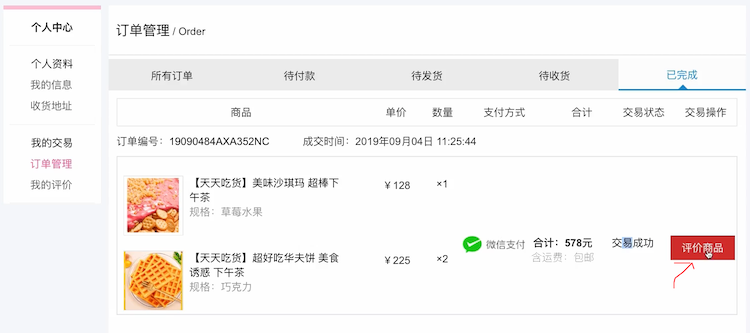
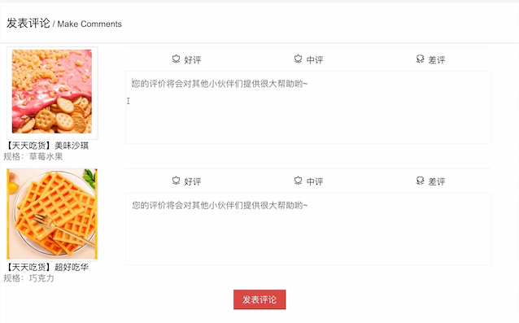

# 评价管理

当订单完成之后，可以对订单评价





可以对每个产品进行评价，可以通过 「我的评价」模块查看历史评价


```html
<li class="td td-change" style="width: 25%;">

  <div v-show="order.orderStatus == 10" @click="goPay(order.orderId, order.payMethod, order.realPayAmount)" class="am-btn am-btn-danger anniu">
    一键支付
  </div>
  <p v-show="order.orderStatus == 20" class="Mystatus">拣货中</p>
  <div v-show="order.orderStatus == 30" @click="confirmReceive(order.orderId)" class="am-btn am-btn-danger anniu">
    确认收货
  </div>
  <div v-show="order.isComment == 0 && order.orderStatus == 40" @click="commentItems(order.orderId)" class="am-btn am-btn-danger anniu">
    评价商品
  </div>
  <div v-show="order.isComment == 1 && order.orderStatus == 40" class="Mystatus">
    已评价
  </div>
  <div v-show="order.orderStatus == 50" @click="deleteOrder(order.orderId)" class="am-btn am-btn-danger anniu">
    删除订单
  </div>

</li>
```

订单列表里面根据订单状态，还有是否已经评论过，给给出是否能评价的入口。

## 查询待评价商品列表

```java
    @ApiOperation(value = "查询订单列表", notes = "查询订单列表", httpMethod = "POST")
    @PostMapping("/pending")
    public JSONResult pending(
            @ApiParam(name = "userId", value = "用户id", required = true)
            @RequestParam String userId,
            @ApiParam(name = "orderId", value = "订单id", required = true)
            @RequestParam String orderId) {

        // 判断用户和订单是否关联
        JSONResult checkResult = checkUserOrder(userId, orderId);
        if (checkResult.getStatus() != HttpStatus.OK.value()) {
            return checkResult;
        }
        // 判断该笔订单是否已经评价过，评价过了就不再继续
        Orders myOrder = (Orders) checkResult.getData();
        if (myOrder.getIsComment() == YesOrNo.YES.type) {
            return JSONResult.errorMsg("该笔订单已经评价");
        }

        List<OrderItems> list = myCommentsService.queryPendingComment(orderId);

        return JSONResult.ok(list);
    }
```

```java
    @Transactional(propagation = Propagation.SUPPORTS)
    @Override
    public List<OrderItems> queryPendingComment(String orderId) {
        OrderItems query = new OrderItems();
        query.setOrderId(orderId);
        return orderItemsMapper.select(query);
    }
```

直接通过订单 ID 查询子单列表即可

## 评价商品(批量插入)

```java
    @ApiOperation(value = "保存评论列表", notes = "保存评论列表", httpMethod = "POST")
    @PostMapping("/saveList")
    public JSONResult saveList(
            @ApiParam(name = "userId", value = "用户id", required = true)
            @RequestParam String userId,
            @ApiParam(name = "orderId", value = "订单id", required = true)
            @RequestParam String orderId,
            @RequestBody List<OrderItemsCommentBO> commentList) {

        System.out.println(commentList);

        // 判断用户和订单是否关联
        JSONResult checkResult = checkUserOrder(userId, orderId);
        if (checkResult.getStatus() != HttpStatus.OK.value()) {
            return checkResult;
        }
        // 判断评论内容list不能为空
        if (commentList == null || commentList.isEmpty() || commentList.size() == 0) {
            return JSONResult.errorMsg("评论内容不能为空！");
        }

        myCommentsService.saveComments(orderId, userId, commentList);
        return JSONResult.ok();
    }
```

OrderItemsCommentBO

```java
public class OrderItemsCommentBO {

    private String commentId;
    private String itemId; // 子单 id
    private String itemName;
    private String itemSpecId;
    private String itemSpecName;
    private Integer commentLevel; // 评价级别
    private String content; // 评价内容
```

```java
    @Transactional(propagation = Propagation.REQUIRED)
    @Override
    public void saveComments(String orderId, String userId,
                             List<OrderItemsCommentBO> commentList) {

        // 1. 保存评价 items_comments
        for (OrderItemsCommentBO oic : commentList) {
            oic.setCommentId(sid.nextShort());
        }
        Map<String, Object> map = new HashMap<>();
        map.put("userId", userId);
        map.put("commentList", commentList);
        itemsCommentsMapperCustom.saveComments(map);

        // 2. 修改订单表改已评价 orders
        Orders order = new Orders();
        order.setId(orderId);
        order.setIsComment(YesOrNo.YES.type);
        ordersMapper.updateByPrimaryKeySelective(order);

        // 3. 修改订单状态表的留言时间 order_status
        OrderStatus orderStatus = new OrderStatus();
        orderStatus.setOrderId(orderId);
        orderStatus.setCommentTime(new Date());
        orderStatusMapper.updateByPrimaryKeySelective(orderStatus);
    }
```

批量保存

```xml
  <select id="saveComments" parameterType="Map">

    insert into
      items_comments
      (
        id,
        user_id,
        item_id,
        item_name,
        item_spec_id,
        sepc_name,
        comment_level,
        content,
        created_time,
        updated_time
      )
    values
      <foreach collection="commentList" item="item" index="index" separator=",">
      (
        #{item.commentId},
        #{userId},
        #{item.itemId},
        #{item.itemName},
        #{item.itemSpecId},
        #{item.itemSpecName},
        #{item.commentLevel},
        #{item.content},
        now(),
        now()
      )
      </foreach>

  </select>
```

需要注意的是：评论表里面冗余存储了子单的部分相关信息：如 商品名称、商品规格 ID、子单 ID

保存评论之后，页面直接跳转到了所有订单查询列表。

## 我的评价列表查询（历史评价）


评价表中保存的时候，没有保存商品图片，所以只需要关联查询一下就好了

```java
@ApiOperation(value = "查询我的评价", notes = "查询我的评价", httpMethod = "POST")
    @PostMapping("/query")
    public JSONResult query(
            @ApiParam(name = "userId", value = "用户id", required = true)
            @RequestParam String userId,
            @ApiParam(name = "page", value = "查询下一页的第几页", required = false)
            @RequestParam Integer page,
            @ApiParam(name = "pageSize", value = "分页的每一页显示的条数", required = false)
            @RequestParam Integer pageSize) {

        if (StringUtils.isBlank(userId)) {
            return JSONResult.errorMsg(null);
        }
        if (page == null) {
            page = 1;
        }
        if (pageSize == null) {
            pageSize = COMMON_PAGE_SIZE;
        }

        PagedGridResult grid = myCommentsService.queryMyComments(userId,
                page,
                pageSize);

        return JSONResult.ok(grid);
    }
```

```java
    @Transactional(propagation = Propagation.SUPPORTS)
    @Override
    public PagedGridResult queryMyComments(String userId,
                                           Integer page,
                                           Integer pageSize) {

        Map<String, Object> map = new HashMap<>();
        map.put("userId", userId);

        PageHelper.startPage(page, pageSize);
        List<MyCommentVO> list = itemsCommentsMapperCustom.queryMyComments(map);

        return setterPagedGrid(list, page);
    }
```

```xml
    <resultMap id="myComments" type="cn.mrcode.foodiedev.pojo.vo.MyCommentVO">
        <id column="commentId" property="commentId"/>
        <result column="content" property="content"/>
        <result column="createdTime" property="createdTime"/>
        <result column="itemId" property="itemId"/>
        <result column="itemName" property="itemName"/>
        <result column="sepcName" property="specName"/>
        <result column="itemImg" property="itemImg"/>
    </resultMap>

    <select id="queryMyComments" parameterType="Map" resultMap="myComments">
        SELECT ic.id           as commentId,
               ic.content      as content,
               ic.created_time as createdTime,
               ic.item_id      as itemId,
               ic.item_name    as itemName,
               ic.sepc_name    as sepcName,
               ii.url          as itemImg
        FROM items_comments ic
                 LEFT JOIN
             items_img ii ON ic.item_id = ii.item_id
        WHERE ic.user_id = #{paramsMap.userId}
          AND ii.is_main = 1
        ORDER BY ic.created_time
            desc
    </select>
```

