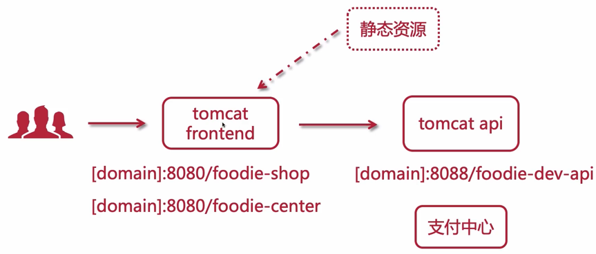

# 部署 nginx 到云端

## 现阶段部署架构

现阶段部署的 tomcat 集群，是使用 tomcat 来部署后端和前端服务的，他们需要通过不同的端口才能访问到，在使用 nginx 时，可以使用虚拟主机来去掉端口号



## Nginx 部署架构


笔者这里的域名规划为：

- 前端：
  - 网站：shop.shop.cn
  - 个人中心：center.shop.cn
- 后端：api.shop.cn

## 部署后端服务

 nginx 的安装请参考前面的章节

集群安装不演示，配置按集群的方式配，笔者这里规划如下：

- 192.168.56.105：统一 nginx 入口
- 192.168.56.106：网站、个人中心
- 192.168.56.107：后端 API

主：笔者这里没有云端服务器，还是使用虚拟机来学习

在 105 上配置后端代理：api.conf

```lua
# 在这里 upstream 的名称可以定义成域名
upstream api.shop.cn {
   server 192.168.56.107:8080;
}

server {
  listen 80;
  server_name api.shop.cn;
  
  location ~ {
    # 这里转发到 upstream 的时候也就可以直接写域名了
    proxy_pass http://api.shop.cn;
  }
}
```

同样使用 hosts 来模拟域名

```
# nginx
192.168.56.105 api.shop.cn
192.168.56.105 shop.shop.cn
192.168.56.105 center.shop.cn
```

测试是否配置成功：

```
http://api.shop.cn/foodie-dev-api/doc.html
```

这里访问的是带路径的 tomcat api 由于后端服务，暂时还是以原始的 tomcat 部署的

## 部署前端服务

为了方便，笔者这里直接使用 scp 命令从 105 上将 nginx 拷贝到 106 上，再删除掉不需要的配置

```bash
[root@study local]# scp -r nginx/ root@192.168.56.106:/usr/local/

# 由于是复制的，少了几个目录，需要先创建出来
mkdir /var/run/nginx
mkdir -p /var/temp/nginx/
mkdir /var/log/nginx
```

将前端的两个项目都放到目录中

```
mkdir /home/website
[root@study conf]# ll /home/website/
总用量 4
drwxr-xr-x. 10 root root  273 4月  15 06:52 foodie-center
drwxr-xr-x. 12 root root 4096 4月  15 06:57 foodie-shop
```

注意：在前端项目中相关的 app.js 中涉及到的相关链接需要修改成这里对应的

`foodie-center/js/app.js`

```javascript
    serverUrl: "http://api.shop.cn/foodie-dev-api",                      // 接口服务接口地址
    paymentServerUrl: "http://payment.t.mukewang.com/foodie-payment",       // 支付中心服务地址
    shopServerUrl: "http://shop.shop.cn",                            // 门户网站地址
    centerServerUrl: "http://center.shop.cn",                        // 用户中心地址
    cookieDomain: ".shop.cn;",
    ctx: "/foodie-center",
```

`foodie-shop/js/app.js`

```javascript
    serverUrl: "http://api.shop.cn/foodie-dev-api",                      // 接口服务接口地址
    paymentServerUrl: "http://payment.t.mukewang.com/foodie-payment",       // 支付中心服务地址
    shopServerUrl: "http://shop.shop.cn",                            // 门户网站地址
    centerServerUrl: "http://center.shop.cn",                        // 用户中心地址
    cookieDomain: ".shop.cn;",
    ctx: "/foodie-shop",

```

在 106 的 nginx 创建 `website.conf` 在在配置下对两个前端项目进行配置

```lua
server {
  listen 80;
  server_name localhost;
  
  location /foodie-shop {
    root /home/website;
    index index.html;
  }

  location /foodie-center {
    root /home/website;
    index index.html;
  }
}
```

配置后，尝试访问如下两个地址

```
http://192.168.56.106/foodie-shop/
http://192.168.56.106/foodie-center/
```

如果访问成功，表示静态资源部署成功，那么在 105 上使用虚拟主机对这两个网址进行域名的配置，同样创建 `website.conf`

```lua
upstream  shops{
   server 192.168.56.106;
}

upstream  centers{
   server 192.168.56.106;
}

server {
  listen 80;
  server_name shop.shop.cn;
  
  location ~ {
    proxy_pass http://shops;
    # 由于 106 上我们配置了两个项目
    # 所以这里将所有请求的地址前面都增加一个对应的项目名 /foodie-shop
    rewrite "^(.*)$" /foodie-shop/$1 break; 
  }
}

server {
  listen 80;
  server_name center.shop.cn;
  
  location ~ {
    proxy_pass http://centers;
    rewrite "^(.*)$" /foodie-center/$1 break; 
  }
}
```

配置之后，访问如下两个地址，能访问到就说明配置成功了

```
http://center.shop.cn/
http://shop.shop.cn/
```

## Nginx 反向代理跨域配置

```lua
# add_header 'Access-Control-Allow-Origin' * always;
add_header 'Access-Control-Allow-Origin' "$http_origin" always;
# 允许带上 cookie 请求
add_header 'Access-Control-Allow-Credentials' 'true' always;
# 允许请求的方法，如 GET/POST
add_header 'Access-Control-Allow-Methods' * always;
# 允许请求的 header
add_header 'Access-Control-Allow-Headers' * always;
if ($request_method = 'OPTIONS') {
	return 200;
}
```

笔者配置过以上方式的跨域，没有成功，出现的问题如下：必须增加 always，在任何响应下都添加这些头，添加之后控制台不会出现一大堆的 cors 错误信息了，但是直接出现 403 状态，没有错误信息

然后笔者没有在 Nginx 中配置这段代码，在后端项目中配置了跨域的配置为允许所有

```java
@Configuration
public class CorsConfig {
    @Bean
    public CorsFilter corsFilter() {
        CorsConfiguration config = new CorsConfiguration();
        // 设置运行跨域的地址，也可以使用 * 代替允许所有地址
        config.addAllowedOrigin("*");
        // 是否运行携带 cookie 相关信息
        // 在前端也有的框架可以配置这一样，前端是否允许跨域的时候携带：axios.defaults.withCredentials = true;
        config.setAllowCredentials(true);
        // 允许访问所有的 http 请求方式，如 get、post
        config.addAllowedMethod("*");
        config.addAllowedHeader("*");

        // 为 url 添加映射路径
        // 允许所有路径使用该配置
        UrlBasedCorsConfigurationSource source = new UrlBasedCorsConfigurationSource();
        source.registerCorsConfiguration("/**", config);

        return new CorsFilter(source);
    }
}
```

那么请求响应的头如下

```http
access-control-allow-credentials: true
access-control-allow-origin: http://shop.shop.cn
connection: keep-alive
content-type: application/json;charset=UTF-8
date: Thu, 15 Apr 2021 00:33:39 GMT
server: nginx/1.16.1
transfer-encoding: chunked
vary: Origin, Access-Control-Request-Method, Access-Control-Request-Headers
```

后来笔者又测试了一下，在 nginx 中只增加 `access-control-allow-credentials` 和 `access-control-allow-origin` 配置，发现到达了后端，设置的允许信息重复了

结论：或许要让这些生效，只能在某一端配置，而不能都配置，可以尝试下，应该是正确的