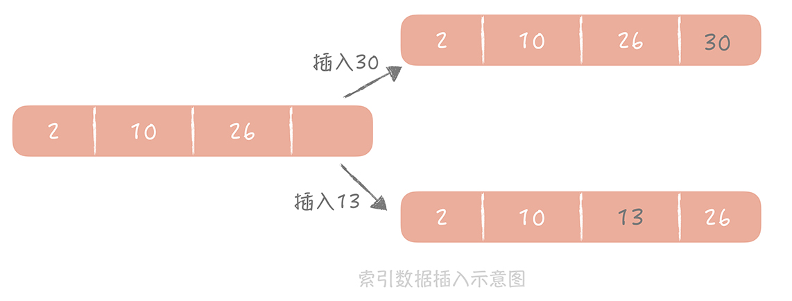

# 10丨发号器：如何保证分库分表后 ID 的全局唯一性？

在前面两节课程中，我带你了解了分布式存储两个核心问题：数据冗余和数据分片，以及在传统关系型数据库中是如何解决的。

当我们面临高并发的查询数据请求时，可以使用主从读写分离的方式，部署多个从库分摊读压力；

当存储的数据量达到瓶颈时，我们可以将数据分片存储在多个节点上，降低单个存储节点的存储压力，此时我们的架构变成了下面这个样子：

你可以看到，我们通过分库分表和主从读写分离的方式解决了数据库的扩展性问题，但是在 09 讲我也提到过，数据库在分库分表之后，我们在使用数据库时存在的许多限制，比方说查询的时候必须带着分区键；一些聚合类的查询（像是 `count()`）性能较差，需要考虑使用计数器等其它的解决方案，其实分库分表还有一个问题我在 09 中没有提到，就是 **主键的全局唯一性的问题** 。本节课，我将带你一起来了解，在分库分表后如何生成全局唯一的数据库主键。

不过，在探究这个问题之前，你需要对「使用什么字段作为主键」这个问题有所了解，这样才能为我们后续探究如何生成全局唯一的主键做好铺垫。

## 数据库的主键要如何选择？

数据库中的每一条记录都需要有一个唯一的标识，依据数据库的第二范式，数据库中每一个表中都需要有一个唯一的主键，其他数据元素和主键一一对应。

**那么关于主键的选择就成为一个关键点了，** 一般来讲，你有两种选择方式：

1. 使用业务字段作为主键，比如说对于用户表来说，可以使用手机号，email 或者身份证号作为主键。

2. 使用生成的唯一 ID 作为主键。

不过对于大部分场景来说，第一种选择并不适用，比如像评论表你就很难找到一个业务字段作为主键，因为在评论表中，你很难找到一个字段唯一标识一条评论。而对于用户表来说，我们需要考虑的是作为主键的业务字段是否能够唯一标识一个人，一个人可以有多个 email 和手机号，一旦出现变更 email 或者手机号的情况，就需要变更所有引用的外键信息，所以使用 email 或者手机作为主键是不合适的。

身份证号码确实是用户的唯一标识，但是由于它的隐私属性，并不是一个用户系统的必须属性，你想想，你的系统如果没有要求做实名认证，那么肯定不会要求用户填写身份证号码的。并且已有的身份证号码是会变更的，比如在 1999 年时身份证号码就从 15 位变更为 18 位，但是主键一旦变更，以这个主键为外键的表也都要随之变更，这个工作量是巨大的。

**因此，我更倾向于使用生成的 ID 作为数据库的主键。** 不单单是因为它的唯一性，更是因为一旦生成就不会变更，可以随意引用。

在单库单表的场景下，我们可以使用数据库的自增字段作为 ID，因为这样最简单，对于开发人员来说也是透明的。但是当数据库分库分表后，使用自增字段就无法保证 ID 的全局唯一性了。

想象一下，当我们分库分表之后，同一个逻辑表的数据被分布到多个库中，这时如果使用数据库自增字段作为主键，那么只能保证在这个库中是唯一的，无法保证全局的唯一性。那么假如你来设计用户系统的时候，使用自增 ID 作为用户 ID，就可能出现两个用户有两个相同的 ID，这是不可接受的，那么你要怎么做呢？我建议你搭建发号器服务来生成全局唯一的 ID。

## 基于 Snowflake 算法搭建发号器

从我历年所经历的项目中，我主要使用的是 **变种的 Snowflake 算法来生成业务需要的 ID 的** ，本讲的重点，也是运用它去解决 ID 全局唯一性的问题。搞懂这个算法，知道它是怎么实现的，就足够你应用它来设计一套分布式发号器了，不过你可能会说了：「那你提全局唯一性，怎么不提 UUID 呢？」

没错，UUID（Universally Unique Identifier，通用唯一标识码）不依赖于任何第三方系统，所以在性能和可用性上都比较好，**我一般会使用它生成 Request ID 来标记单次请求**， 但是如果用它来作为数据库主键，它会存在以下几点问题。

首先，生成的 ID 做好具有单调递增性，也就是有序的，而 UUID 不具备这个特点。为什么 ID 要是有序的呢？ **因为在系统设计时，ID 有可能成为排序的字段。**  我给你举个例子。

比如，你要实现一套评论的系统时，你一般会设计两个表，一张评论表，存储评论的详细信息，其中有 ID 字段，有评论的内容，还有评论人 ID，被评论内容的 ID 等等，以 ID 字段作为分区键；另一个是评论列表，存储着内容 ID 和评论 ID 的对应关系，以内容 ID 为分区键。

我们在获取内容的评论列表时，需要按照时间序倒序排列，因为 ID 是时间上有序的，所以我们就可以按照评论 ID 的倒序排列。而如果评论 ID 不是在时间上有序的话，我们就需要在评论列表中再存储一个多余的创建时间的列用作排序，假设内容 ID、评论 ID 和时间都是使用 8 字节存储，我们就要多出 50% 的存储空间存储时间字段，造成了存储空间上的浪费。

**另一个原因在于 ID 有序也会提升数据的写入性能。**

我们知道 MySQL InnoDB 存储引擎使用 `B+ 树` 存储索引数据，而主键也是一种索引。索引数据在 `B+ 树` 中是有序排列的，就像下面这张图一样，图中 2，10，26 都是记录的 ID，也是索引数据。

这时，当插入的下一条记录的 ID 是递增的时候，比如插入 30 时，数据库只需要把它追加到后面就好了。但是如果插入的数据是无序的，比如 ID 是 13，那么数据库就要查找 13 应该插入的位置，再挪动 13 后面的数据，这就造成了多余的数据移动的开销。

我们知道机械磁盘在完成随机的写时，需要先做 「寻道」找到要写入的位置，也就是让磁头找到对应的磁道，这个过程是非常耗时的。**而顺序写就不需要寻道，会大大提升索引的写入性能** 。

**UUID 不能作为 ID 的另一个原因是它不具备业务含义，** 其实现实世界中使用的 ID 中都包含有一些有意义的数据，这些数据会出现在 ID 的固定的位置上。比如说我们使用的身份证的前六位是地区编号；7～14 位是身份证持有人的生日；不同城市电话号码的区号是不同的；你从手机号码的的前三位就可以看出这个手机号隶属于哪一个运营商。而如果生成的 ID 可以被反解，那么从反解出来的信息中我们可以对 ID 来做验证，我们可以从中知道这个 ID 的生成时间，从哪个机房的发号器中生成的，为哪个业务服务的，对于问题的排查有一定的帮助。

最后，UUID 是由 32 个 16 进制数字组成的字符串，如果作为数据库主键使用比较耗费空间。

你能看到，UUID 方案有很大的局限性，也是我不建议你用它的原因，而 twitter 提出的 Snowflake 算法完全可以弥补 UUID 存在的不足，因为它不仅算法简单易实现，也满足 ID 所需要的全局唯一性，单调递增性，还包含一定的业务上的意义。

Snowflake 的核心思想是将 64bit 的二进制数字分成若干部分，每一部分都存储有特定含义的数据，比如说时间戳、机器 ID、序列号等等，最终生成全局唯一的有序 ID。它的标准算法是这样的：

从上面这张图中我们可以看到，41 位的时间戳大概可以支撑 `pow(2,41)/1000/60/60/24/365`  年，约等于 69 年，对于一个系统是足够了。

如果你的系统部署在多个机房，那么 10 位的机器 ID 可以继续划分为 2～3 位的 IDC 标示（可以支撑 4 个或者 8 个 IDC 机房）和 7～8 位的机器 ID（支持 128-256 台机器）；12 位的序列号代表着每个节点每毫秒最多可以生成 4096 的 ID。

不同公司也会依据自身业务的特点对 Snowflake 算法做一些改造，比如说减少序列号的位数增加机器 ID 的位数以支持单 IDC 更多的机器，也可以在其中加入业务 ID 字段来区分不同的业务。 **比方说我现在使用的发号器的组成规则就是：** 1 位兼容位恒为 0 + 41 位时间信息 + 6 位 IDC 信息（支持 64 个 IDC）+ 6 位业务信息（支持 64 个业务）+ 10 位自增信息（每毫秒支持 1024 个号）

我选择这个组成规则，主要是因为我在单机房只部署一个发号器的节点，并且使用 KeepAlive 保证可用性。业务信息指的是项目中哪个业务模块使用，比如用户模块生成的 ID，内容模块生成的 ID，把它加入进来，一是希望不同业务发出来的 ID 可以不同，二是因为在出现问题时可以反解 ID，知道是哪一个业务发出来的 ID。

那么了解了 Snowflake 算法的原理之后，我们如何把它工程化，来为业务生成全局唯一的 ID 呢？ **一般来说我们会有两种算法的实现方式：**

**一种是嵌入到业务代码里，也就是分布在业务服务器中。** 这种方案的好处是业务代码在使用的时候不需要跨网络调用，性能上会好一些，但是就需要更多的机器 ID 位数来支持更多的业务服务器。另外，由于业务服务器的数量很多，我们很难保证机器 ID 的唯一性，所以就需要引入 ZooKeeper 等分布式一致性组件来保证每次机器重启时都能获得唯一的机器 ID。

**另外一个部署方式是作为独立的服务部署，这也就是我们常说的发号器服务。** 业务在使用发号器的时候就需要多一次的网络调用，但是内网的调用对于性能的损耗有限，却可以减少机器 ID 的位数，如果发号器以主备方式部署，同时运行的只有一个发号器，那么机器 ID 可以省略，这样可以留更多的位数给最后的自增信息位。即使需要机器 ID，因为发号器部署实例数有限，那么就可以把机器 ID 写在发号器的配置文件里，这样即可以保证机器 ID 唯一性，也无需引入第三方组件了。 **微博和美图都是使用独立服务的方式来部署发号器的，性能上单实例单 CPU 可以达到两万每秒。**

Snowflake 算法设计的非常简单且巧妙，性能上也足够高效，同时也能够生成 **具有全局唯一性、单调递增性和有业务含义的 ID** ，但是它也有一些缺点，**其中最大的缺点就是它依赖于系统的时间戳**，一旦系统时间不准，就有可能生成重复的 ID。所以如果我们发现系统时钟不准，就可以让发号器暂时拒绝发号，直到时钟准确为止。

另外，如果请求发号器的 QPS 不高，比如说发号器每毫秒只发一个 ID，就会造成生成 ID 的末位永远是 1，那么在分库分表时如果使用 ID 作为分区键就会造成库表分配的不均匀。 **这一点，也是我在实际项目中踩过的坑，而解决办法主要有两个：** 

1. 时间戳不记录毫秒而是记录秒，这样在一个时间区间里可以多发出几个号，避免出现分库分表时数据分配不均。

2. 生成的序列号的起始号可以做一下随机，这一秒是 21，下一秒是 30，这样就会尽量的均衡了。

我在开头提到，自己的实际项目中采用的是变种的 Snowflake 算法，也就是说对 Snowflake 算法进行了一定的改造，从上面的内容中你可以看出，这些改造：

- 一是要让算法中的 ID 生成规则符合自己业务的特点；
- 二是为了解决诸如时间回拨等问题。

其实，大厂除了采取 Snowflake 算法之外，还会选用一些其他的方案，比如滴滴和美团都有提出基于数据库生成 ID 的方案。这些方法根植于公司的业务，同样能解决分布式环境下 ID 全局唯一性的问题。对你而言，可以多角度了解不同的方法，这样能够寻找到更适合自己业务目前场景的解决方案，不过我想说的是， **方案不在多，而在精，方案没有最好，只有最适合，真正弄懂方法背后的原理，并将它落地，才是你最佳的选择。** 

## 课程小结

本节课，我结合自己的项目经历带你了解了如何使用 Snowflake 算法解决分库分表后数据库 ID 的全局唯一的问题，在这个问题中，又延伸性地带你了解了生成的 ID 需要满足单调递增性，以及要具有一定业务含义的特性。当然，我们重点的内容是讲解如何将 Snowflake 算法落地，以及在落地过程中遇到了哪些坑，带你去解决它。

Snowflake 的算法并不复杂，你在使用的时候可以不考虑独立部署的问题，先想清楚按照自身的业务场景，需要如何设计 Snowflake 算法中的每一部分占的二进制位数。比如你的业务会部署几个 IDC，应用服务器要部署多少台机器，每秒钟发号个数的要求是多少等等，然后在业务代码中实现一个简单的版本先使用，等到应用服务器数量达到一定规模，再考虑独立部署的问题就可以了。这样可以避免多维护一套发号器服务，减少了运维上的复杂度。

## 一课一思

今天的课程中我们了解了分布式发号器的实现原理和生成 ID 的特性，那么在你的系统中你的 ID 是如何生成的呢？

## 拓展阅读

- 其他的发号器

  [微信发号器 seqsvr](https://mp.weixin.qq.com/s?__biz=MzI4NDMyNTU2Mw==&mid=2247483679&idx=1&sn=584dbd80aa08fa1188627ad725680928&mpshare=1&scene=1&srcid=1208L9z4yXKLW60rPph2ZmMn#rd)

  [百度 UidGenerator](https://github.com/baidu/uid-generator/blob/master/README.zh_cn.md)

- 同一时间位，同一机器，在生成序列号时，是要上锁的吧？

  是的 不过像 redis 那样单线程处理就好了

- snowflake 不能保证单调递增吧？首先，服务器的时钟可能有快有慢；其次，同一时刻，机器号大的机器生成的 ID 总是大于机器号小的机器，但他的请求可能是先到达了数据库。

  首先，服务器的时钟一般是对时的，其次，如果是单独部署的发号器，没有机器 ID 是可以保证单调递增的

- 关于 41 位的时间戳的可支撑时间问题, 如果时间戳是从 0 开始计算则约可以支持 69 年, 但如果以当前时间开始算, 则可用的只有不到 20 年了( `69-(2019-1970)` )

  实现时可以不以 1970 年为基准时间