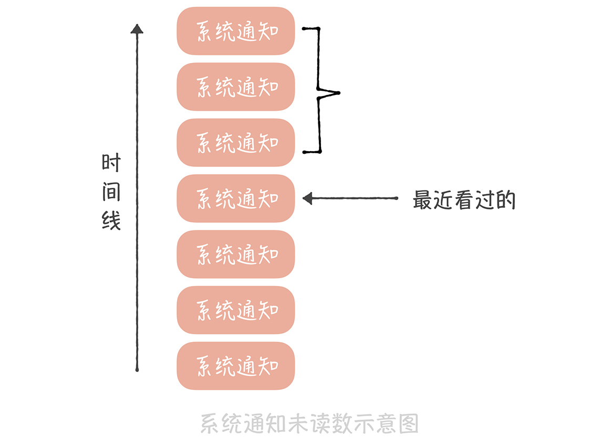
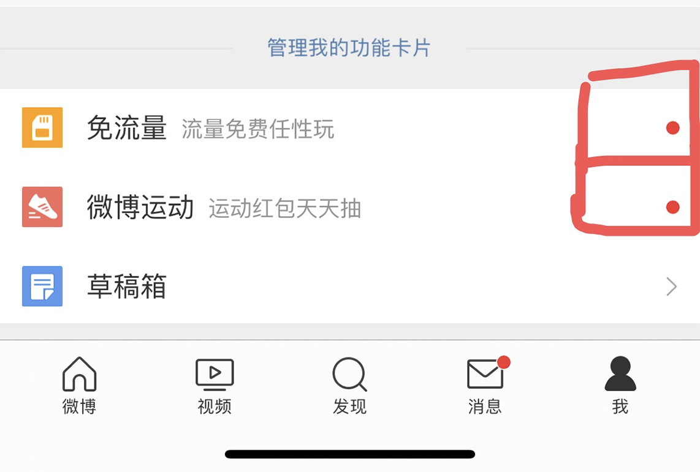
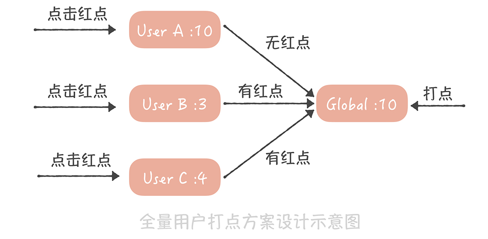
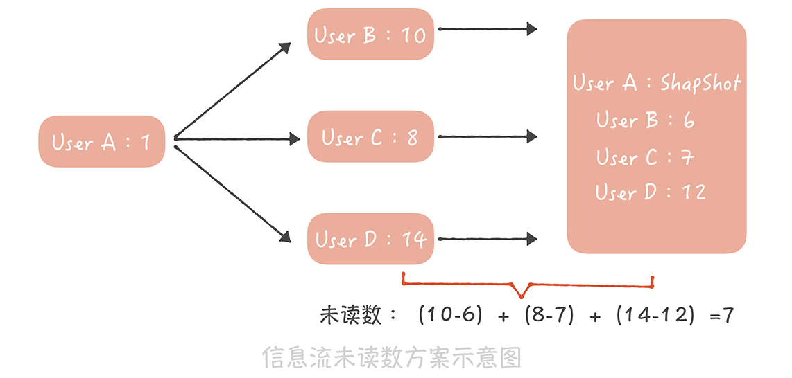

# 38丨计数系统设计 2：50 万 QPS 下如何设计未读数系统？

在上一节课中我带你了解了如何设计一套支撑高并发访问和存储大数据量的通用计数系统，我们通过缓存技术、消息队列技术以及对于 Redis 的深度改造，就能够支撑万亿级计数数据存储以及每秒百万级别读取请求了。然而有一类特殊的计数并不能完全使用我们提到的方案，那就是未读数。

未读数也是系统中一个常见的模块，以微博系统为例，你可看到有多个未读计数的场景，比如：

- 当有人 `@你`、评论你、给你的博文点赞或者给你发送私信的时候，你会收到相应的未读提醒；

- 在早期的微博版本中有系统通知的功能，也就是系统会给全部用户发送消息，通知用户有新的版本或者有一些好玩的运营活动，如果用户没有看，系统就会给他展示有多少条未读的提醒。

- 我们在浏览信息流的时候，如果长时间没有刷新页面，那么信息流上方就会提示你在这段时间有多少条信息没有看。

那当你遇到第一个需求时，要如何记录未读数呢？其实，这个需求可以用上节课提到的通用计数系统来实现，因为二者的场景非常相似。

你可以在计数系统中增加一块儿内存区域，以用户 ID 为 Key 存储多个未读数，当有人 `@` 你时，增加你的未读 @的计数；当有人评论你时，增加你的未读评论的计数，以此类推。当你点击了未读数字进入通知页面，查看 `@` 你或者评论你的消息时，重置这些未读计数为零。相信通过上一节课的学习，你已经非常熟悉这一类系统的设计了，所以我不再赘述。

那么系统通知的未读数是如何实现的呢？我们能用通用计数系统实现吗？答案是不能的，因为会出现一些问题。

## 系统通知的未读数要如何设计

来看具体的例子。假如你的系统中只有 A、B、C 三个用户，那么你可以在通用计数系统中增加一块儿内存区域，并且以用户 ID 为 Key 来存储这三个用户的未读通知数据，当系统发送一个新的通知时，我们会循环给每一个用户的未读数加 1，这个处理逻辑的伪代码就像下面这样：

```java
List<Long> userIds = getAllUserIds();
for(Long id : userIds) {
  incrUnreadCount(id);
}
```

这样看来，似乎简单可行，但随着系统中的用户越来越多，这个方案存在两个致命的问题。

首先，获取全量用户就是一个比较耗时的操作，相当于对用户库做一次全表的扫描，这不仅会对数据库造成很大的压力，而且查询全量用户数据的响应时间是很长的，对于在线业务来说是难以接受的。如果你的用户库已经做了分库分表，那么就要扫描所有的库表，响应时间就更长了。**不过有一个折中的方法，**  那就是在发送系统通知之前，先从线下的数据仓库中获取全量的用户 ID，并且存储在一个本地的文件中，然后再轮询所有的用户 ID，给这些用户增加未读计数。

这似乎是一个可行的技术方案，然而它给所有人增加未读计数，会消耗非常长的时间。你计算一下，假如你的系统中有一个亿的用户，给一个用户增加未读数需要消耗 1ms，那么给所有人都增加未读计数就需要 100000000 * 1 /1000 = 100000 秒，也就是超过一天的时间；即使你启动 100 个线程并发的设置，也需要十几分钟的时间才能完成，而用户很难接受这么长的延迟时间。

另外，使用这种方式需要给系统中的每一个用户都记一个未读数的值，而在系统中，活跃用户只是很少的一部分，大部分的用户是不活跃的，甚至从来没有打开过系统通知，为这些用户记录未读数显然是一种浪费。

通过上面的内容，你可以知道为什么我们不能用通用计数系统实现系统通知未读数了吧？那正确的做法是什么呢？

要知道，系统通知实际上是存储在一个大的列表中的，这个列表对所有用户共享，也就是所有人看到的都是同一份系统通知的数据。不过不同的人最近看到的消息不同，所以每个人会有不同的未读数。因此，你可以记录一下在这个列表中每个人看过最后一条消息的 ID，然后统计这个 ID 之后有多少条消息，这就是未读数了。



这个方案在实现时有这样几个关键点：

- 用户访问系统通知页面需要设置未读数为 0，我们需要将用户最近看过的通知 ID 设置为最新的一条系统通知 ID；

- 如果最近看过的通知 ID 为空，则认为是一个新的用户，返回未读数为 0；

- 对于非活跃用户，比如最近一个月都没有登录和使用过系统的用户，可以把用户最近看过的通知 ID 清空，节省内存空间。

**这是一种比较通用的方案，即节省内存，又能尽量减少获取未读数的延迟。** 这个方案适用的另一个业务场景是全量用户打点的场景，比如像下面这张微博截图中的红点。



这个红点和系统通知类似，也是一种通知全量用户的手段，如果逐个通知用户，延迟也是无法接受的。 **因此你可以采用和系统通知类似的方案。**

首先，我们为每一个用户存储一个时间戳，代表最近点过这个红点的时间，用户点了红点，就把这个时间戳设置为当前时间；然后，我们也记录一个全局的时间戳，这个时间戳标识最新的一次打点时间，如果你在后台操作给全体用户打点，就更新这个时间戳为当前时间。而我们在判断是否需要展示红点时，只需要判断用户的时间戳和全局时间戳的大小，如果用户时间戳小于全局时间戳，代表在用户最后一次点击红点之后又有新的红点推送，那么就要展示红点，反之，就不展示红点了。



这两个场景的共性是 **全部用户共享一份有限的存储数据**，每个人只记录自己在这份存储中的偏移量，就可以得到未读数了。

你可以看到，系统消息未读的实现方案不是很复杂，它通过设计避免了操作全量数据未读数，如果你的系统中有这种打红点的需求，那我建议你可以结合实际工作灵活使用上述方案。

最后一个需求关注的是微博信息流的未读数，在现在的社交系统中，关注关系已经成为标配的功能，而基于关注关系的信息流也是一种非常重要的信息聚合方式，因此，如何设计信息流的未读数系统就成了你必须面对的一个问题。

## 如何为信息流的未读数设计方案

信息流的未读数之所以复杂主要有这样几点原因。

- 首先，微博的信息流是基于关注关系的，未读数也是基于关注关系的

  就是说，你关注的人发布了新的微博，那么你作为粉丝未读数就要增加 1。如果微博用户都是像我这样只有几百粉丝的 「小透明」 就简单了，你发微博的时候系统给你粉丝的未读数增加 1 不是什么难事儿。但是对于一些动辄几千万甚至上亿粉丝的微博大 V 就麻烦了，增加未读数可能需要几个小时。假设你是杨幂的粉丝，想了解她实时发布的博文，那么如果当她发布博文几个小时之后，你才收到提醒，这显然是不能接受的。所以未读数的延迟是你在设计方案时首先要考虑的内容。

- 其次，信息流未读数请求量极大、并发极高，这是因为接口是客户端轮询请求的，不是用户触发的。也就是说，用户即使打开微博客户端什么都不做，这个接口也会被请求到。在几年前，请求未读数接口的量级就已经接近每秒 50 万次，这几年随着微博量级的增长，请求量也变得更高。而作为微博的非核心接口，我们不太可能使用大量的机器来抗未读数请求，因此，如何使用有限的资源来支撑如此高的流量是这个方案的难点。

- 最后，它不像系统通知那样有共享的存储，因为每个人关注的人不同，信息流的列表也就不同，所以也就没办法采用系统通知未读数的方案。

那要如何设计能够承接每秒几十万次请求的信息流未读数系统呢？你可以这样做：

- 首先，在通用计数器中记录每一个用户发布的博文数；

- 然后在 Redis 或者 Memcached 中记录一个人所有关注人的博文数快照，当用户点击未读消息重置未读数为 0 时，将他关注所有人的博文数刷新到快照中；

- 这样，他关注所有人的博文总数减去快照中的博文总数就是他的信息流未读数。



假如用户 A，像上图这样关注了用户 B、C、D，其中 B 发布的博文数是 10，C 发布的博文数是 8，D 发布的博文数是 14，而在用户 A 最近一次查看未读消息时，记录在快照中的这三个用户的博文数分别是 6、7、12，因此用户 A 的未读数就是（10-6）+（8-7）+（14-12）=7。

这个方案设计简单，并且是全内存操作，性能足够好，能够支撑比较高的并发，事实上微博团队仅仅用 16 台普通的服务器就支撑了每秒接近 50 万次的请求，这就足以证明这个方案的性能有多出色，因此，它完全能够满足信息流未读数的需求。

当然了这个方案也有一些缺陷，比如说快照中需要存储关注关系，如果关注关系变更的时候更新不及时，那么就会造成未读数不准确；快照采用的是全缓存存储，如果缓存满了就会剔除一些数据，那么被剔除用户的未读数就变为 0 了。但是好在用户对于未读数的准确度要求不高（未读 10 条还是 11 条，其实用户有时候看不出来），因此，这些缺陷也是可以接受的。

通过分享未读数系统设计这个案例，我想给你一些建议：

1. 缓存是提升系统性能和抵抗大并发量的神器，像是微博信息流未读数这么大的量级我们仅仅使用十几台服务器就可以支撑，这全都是缓存的功劳；

2. 要围绕系统设计的关键困难点想解决办法，就像我们解决系统通知未读数的延迟问题一样；

3. 合理分析业务场景，明确哪些是可以权衡的，哪些是不行的，会对你的系统设计增益良多，比如对于长久不登录用户，我们就会记录未读数为 0，通过这样的权衡，可以极大地减少内存的占用，减少成本。

## 课程小结

以上就是本节课的全部内容了，本节课我带你了解了未读数系统的设计，这里你需要了解的重点是：

- 评论未读、@未读、赞未读等一对一关系的未读数可以使用上节课讲到的通用计数方案来解决；

  通用计数器：一个用户一类的计数用一个字段存储就可以了，相对简单，就是存储量很大

- 在系统通知未读、全量用户打点等存在有限的共享存储的场景下，可以通过记录用户上次操作的时间或者偏移量，来实现未读方案；

  内容共享，通过最后一次读时间或则 id 的偏移量来计算，要注意的是：这种未读不是指你有 10 篇没有读的文章，读取一篇就减少 1 这种未读统计，而是你总共有多少未读消息数量，点击后就重置为 0 了

- 最后，信息流未读方案最为复杂，采用的是记录用户博文数快照的方式。

  这里和系统全量打点的方式类似，也是点击未读后，计数器就重置为 0 了。但是它有关系计算这是和全量打点方式不一样的地方

这里你可以看到，这三类需求虽然都和未读数有关，但是需求场景不同、对于量级的要求不同，设计出来的方案也就不同。因此，就像我刚刚提到的样子，你在做方案设计的时候，要分析需求的场景，比如说数据的量级是怎样的，请求的量级是怎样的，有没有一些可以利用的特点（比如系统通知未读场景下的有限共享存储、信息流未读场景下关注人数是有限的等等），然后再制定针对性的方案，切忌盲目使用之前的经验套用不同的场景，否则就可能造成性能的下降，甚至危害系统的稳定性。